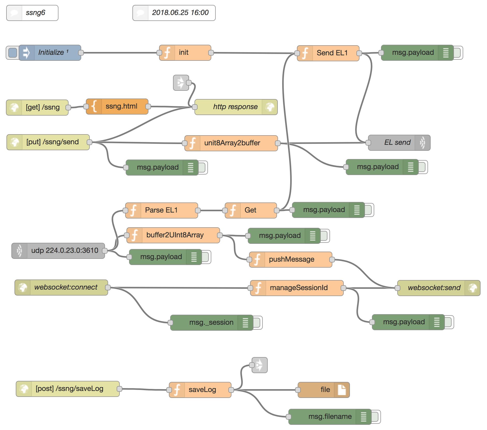
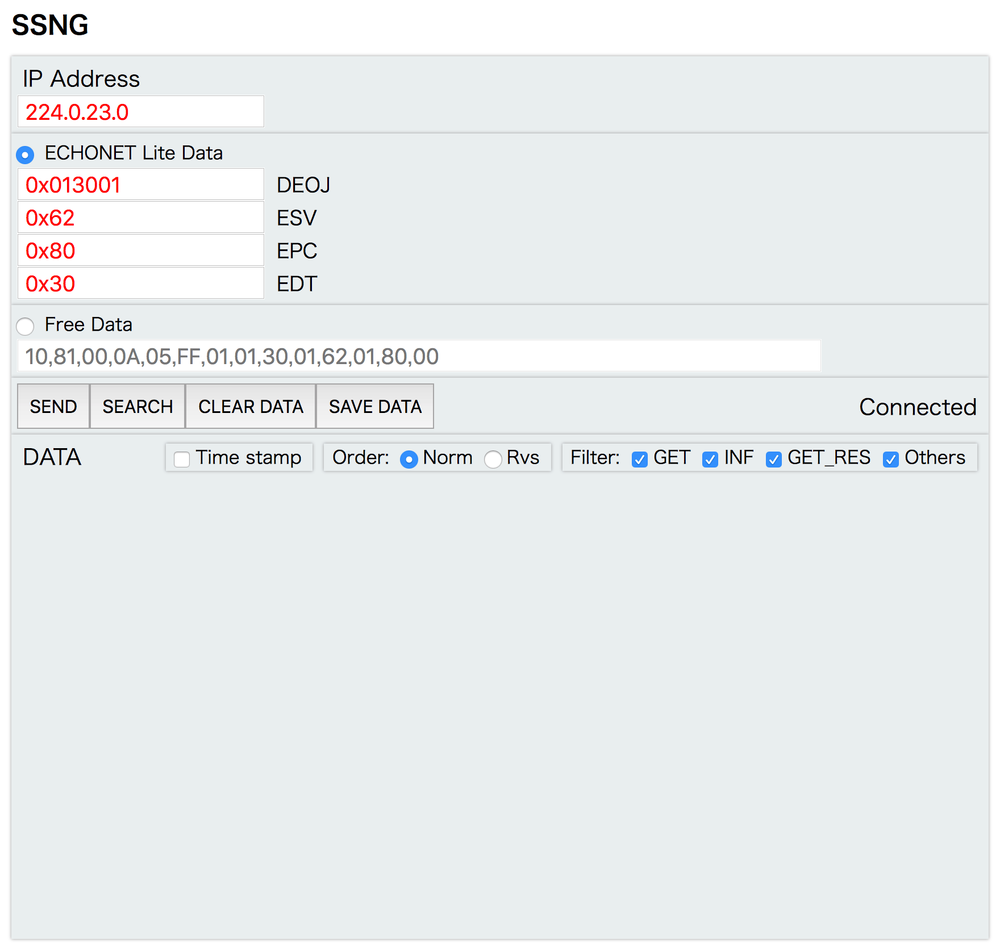
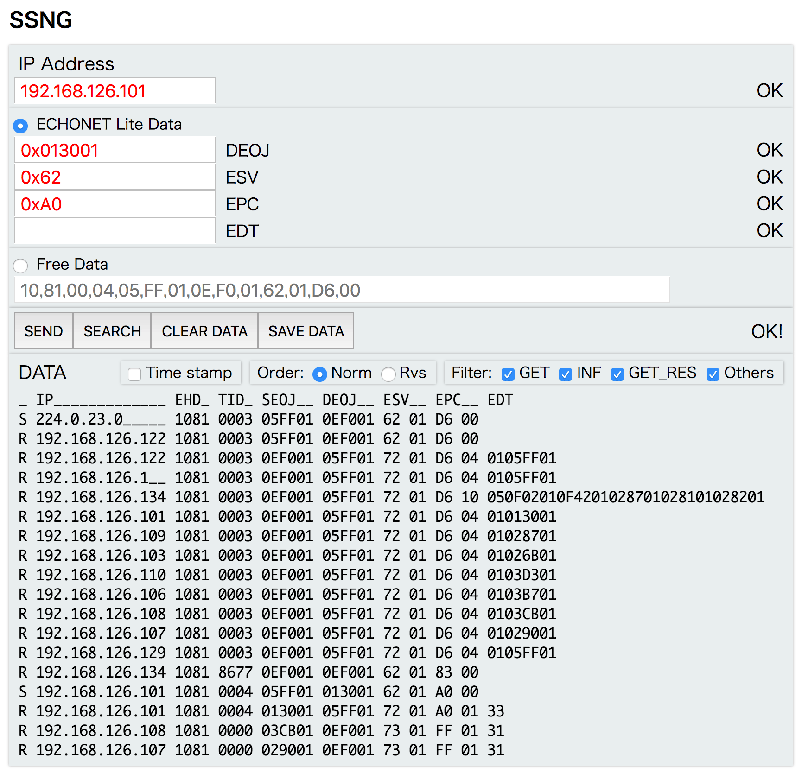
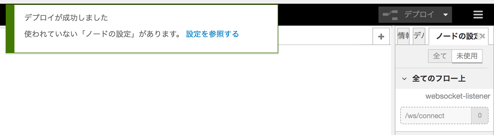
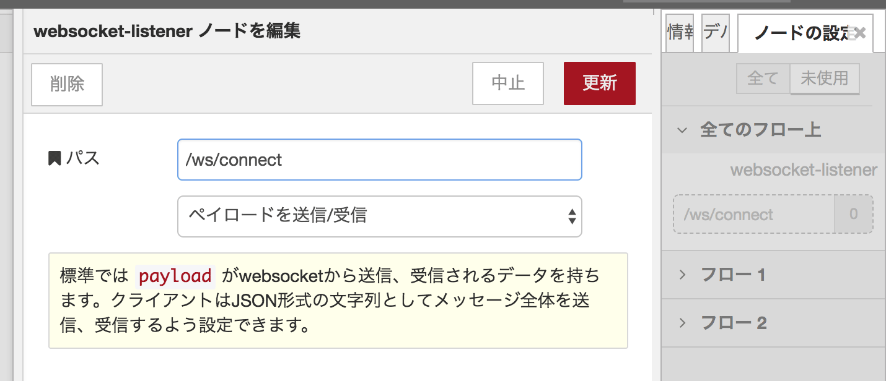

# SSNG for Node-RED

2018.06.25 1st release    

## Abstract
SSNG for Node-REDは、ECHONET Liteコマンド送受信ツールである。Node-REDがインストールされたWindows PC, Mac, Raspberry Piなどで動作する。  

SSNG for Node-RED is a tool to send and receive ECHONET Lite command. It runs on Windows PC, Macintosh or Raspberry Pi with Node-RED installed.

## Requirements
Node-REDがインストールされたWindows PC, Macまたは Raspberry Pi  

Windows PC, Macintosh or Raspberry Pi on which Node-RED is installed.

## Installation & Launch
#### Japanese
1. ターミナルでnode-redを起動する  
2. Web Browserを起動し、localhost:1880 をアクセスする  
3. Web Browser画面にNode-REDの開発画面が表示される  
4. ファイル "ssng_flow.txt" をテキストエディターで開き、全てのテキストをコピーする  
5. Node-REDの読み込み機能でクリップボードを選択、(1)でコピーしたテキストをペーストし、読み込みボタンをクリックするとFlowが表示される(Fig.1)  
6. デプロイボタンをクリックする  
7. Web Browserで別のtabまたはwindowを開き、localhost:1880/ssng をアクセスする  
8. SSNGのGUIが表示される(Fig. 2)  

#### English
1. Launch Node-RED on a terminal window  
2. Launch a Web Browser and access localhost:1880  
3. Development screen of Node-RED is displayed on a Web Browser  
4. Open "ssng_flow.txt" file with a text editor and copy all text.  
5. Select import function of Node-RED, select clipboard, paste text and click import. Then the flow will be displayed. (Fig.1)  
6. Click deploy button.  
7. Open another tab or window and access localhost:1880/ssng  
8. GUI od SSNG is displayed. (Fig. 2)  
  

Fig.1 Flow

  

Fig.2 GUI of SSNG

## How to use
#### Japanese
### 基本的な使い方
　IP Address, DEOJ, ESV, EPC, EDTのデータ入力欄に値を入力し、SENDボタンをクリックするとECHONET Liteコマンドが送信される。受信したECHONET LiteデータはDATA areaに自動的に表示される。  

### IP Address 入力欄
　IPv4形式の値を入力する。初期値はマルチキャストアドレス 224.0.23.0 である。  

### ECHONET Lite Data 入力欄
　16進数(HEX)の値を入力する。"0x"は省略可能。  
　TIDは0x0001から始まり、コマンドを送信するごとに自動でインクリメントされる。OPCは0x01の固定値。PDCはEDTから自動で計算される。EDTが２バイト以上の場合は、0xAA33FF のような値を入力する。EDTが不要なESVの場合、EDT入力欄のデータは無視される。  

### Free Data 入力欄
　OPC=2以上のコマンドを送る場合や、ECHONET Liteとしては正しくないコマンドを送る場合は、Free Data 入力欄を利用する。ラジオボタンでFree Dataを選択するとFree Data を入力できるようになる。入力するデータのフォーマットは、コンマで区切られた１バイトデータ（0xを省略したの16進数）である。

### SEND ボタン
　その時点で選択されている入力欄のデータを用いてECHONET Liteコマンドを送信する。

### SEARCH ボタン
　機器探索のためのコマンドを送信する。

### CLEAR DATA ボタン
　DATA表示欄をクリアする。

### SAVE DATA ボタン
　DATA表示欄のデータをファイルとして保存する。保存先はホームディレクトリで、ファイル名は以下のように "ssngLog\_" の後にtimestamp(YYYYMMDDHHMMSS)を付加したものである。
>　ssngLog_20180625161502.txt

#### English
### Basic usage
Type data to input field of IP Address, DEOJ, ESV, EPC and EDT. Click SEND button, then ECHONET Lite command is sent. Received ECHONET Lite data is displayed in the DATA area automatically.

### IP Address input field
Type IPv4 address. Initial data of 224.0.23.0 is a multicast address of ECHONET Lite.

### ECHONET Lite Data input field
Type HEX data. "0x" can be omitted.  
TID starts from 0x0001 and it is incremented automatically upon sending a new command. OPC is fixed value of 0x01. PDC is calculated automatically with EDT. In case of more than 2 bytes data of EDT, input data like this "0xAA33FF". EDT data is ignored depending on ESV value.

### Free Data input field
Free data input field can be utilized in case OPC is more than 2 or a command is not compliant to ECHONET Lite. Select Free data radio button then input field is enabled. Data format should be comma separated byte data in HEX without "0x".

### SEND Button
Sends a command with data in the currently selected input field.

### SEARCH Button
Sends a command to search ECHONET Lite devices.

### CLEAR Button
Clear data display ares.

### SAVE DATA Button
Save data on Data display area to a home directory. The file name starts with "ssngLog\_" and timestamp(YYYYMMDDHHMMSS) follows. Here is an example.
> "ssngLog\_20180625161502.txt".

## Data display area

  

#### Japanese
DATA表示エリアには、送信・受信したデータが表示される。第１コラムは送受信を示す記号(S:送信/R:受信)、第２コラムはIP addressである。   
DATA表示欄にはデータ表示を制御するチェックボックスやラジオボタンが存在する。

### Time stamp check box
Time stamp(HHMMSS)の付加をコントロールするチェックボックスである。

### Order radio button (Norm, Rvs)
ログデータの表示の順序をコントロールするラジオボタンである。Norm(Normal)を選択すると時間軸は下向き、Rvs(Reverse)を選択すると時間軸は上向きとなる。

### Filter check box (GET, INF, GET_RES, Others)
受信データのESVの値によって表示にフィルタをかける。チェックをはずすと非表示となる。

#### English
Data display area shows sent and received data with a symbol that represent SEND:S and RECEIVE:R at the first column and IP address at the second column.
There are check boxes and radio buttons to control views of data display at DATA display area.

### Time stamp check box
A check box to show/hide time stamp.

### Order radio button (Norm, Rvs)
A radio button to control the order of time.

### Filter check box (GET, INF, GET_RES, Others)
Check boxes to show/hide data by the value of ESV.

## Trouble shooting
Flow を読み込んでデプロイした際に以下のようなアラームが表示された場合は、「設定を参照する」のリンクをクリックすると画面右に「ノードの設定」タブが表示されます。

In case the following alarm is displayed on deploy of a flow, click the link of "refer the setting" then "node setting" tab will be displayed in the right side.

  

その中の「/ws/connect」をクリックすると以下のように表示されます。画面左上の削除ボタンをクリックします。その後デプロイボタンをクリックします。

Click the link of "/es/connect", then the following display appears. Click Delete button at the top left corner, then click Deploy.

  
